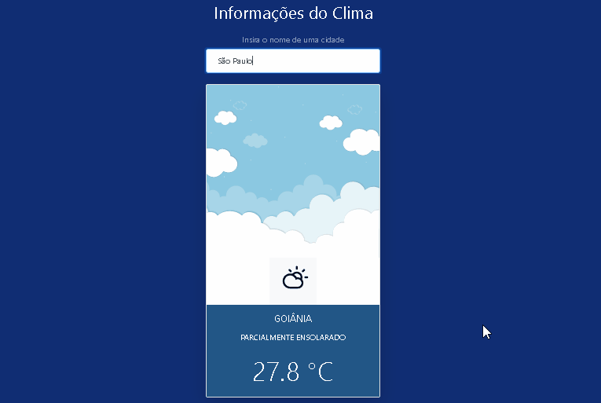

# weather-app

Aplicação que obtém, e mostra ao usuário, dados sobre o clima em uma cidade fornecida. A aplicação consome a versão gratuita da [AccuWeather API](https://developer.accuweather.com/) e utiliza as tecnologias:

* JavaScript
* HTML
* CSS

